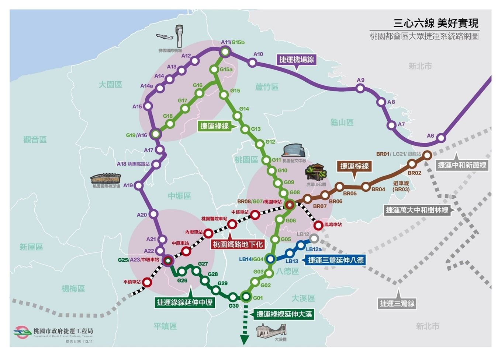

.. _sec-buy-house:

Buy House
=========

Tools
-----

快速查（不用看圖）：地號查詢網站
👉 適合你要快速確認「這塊地在哪個縣市／段」
🔗 https://twlanddata.com/

富旺耀時代Villa
-------------------

富旺耀時代Villa，2026/12月前完工
新竹縣湖口鄉綠園段291地號

`富旺鈺時代預售 <https://market.591.com.tw/5934582>`_，
新竹縣湖口鄉綠園段283地號，比
`富旺耀時代Villa 291地號 <https://maps.app.goo.gl/rB6pcLgJC4gXwVoXA>`_ 遠。

台灣房地產要投資賺錢多數人都懂，也都從此獲利。
多數人想生活在機能方便的住宅區，未成熟新區域生活不便、
價格便宜，只要有錢投資，未來機能成熟時就能獲利、
打敗通膨。青埔與竹北的透天投資皆是如此。
富旺這透天是北湖的最後一案，也是最近車站的透天，交屋
後這透天的取得成本與地點已可打敗北湖站區的其他透天，
若等入住機能成熟也會像之前青埔與竹北的透天一樣。

.. _taoyuan_mrt:

   `桃園捷運 <https://dorts.tycg.gov.tw/cp.aspx?n=23130>`_

桃園機場捷運 A23「中壢車站」預估 2029 年通車
桃園捷運綠線「中壢車站（G25）」預計在 2031 年底 通車。
北湖到中壢區間車24 分，3、5年退休後搭火車接
`桃園捷運 <https://dorts.tycg.gov.tw/cp.aspx?n=23130>`_、
台北旅遊，等玩的差不多了，再賣掉多賺個幾百萬後，換買
高雄住與旅遊。

`台鐵時刻表北湖站 <https://www.railway.gov.tw/tra-tip-web/tip/tip001/tip112/gobystation>`_

