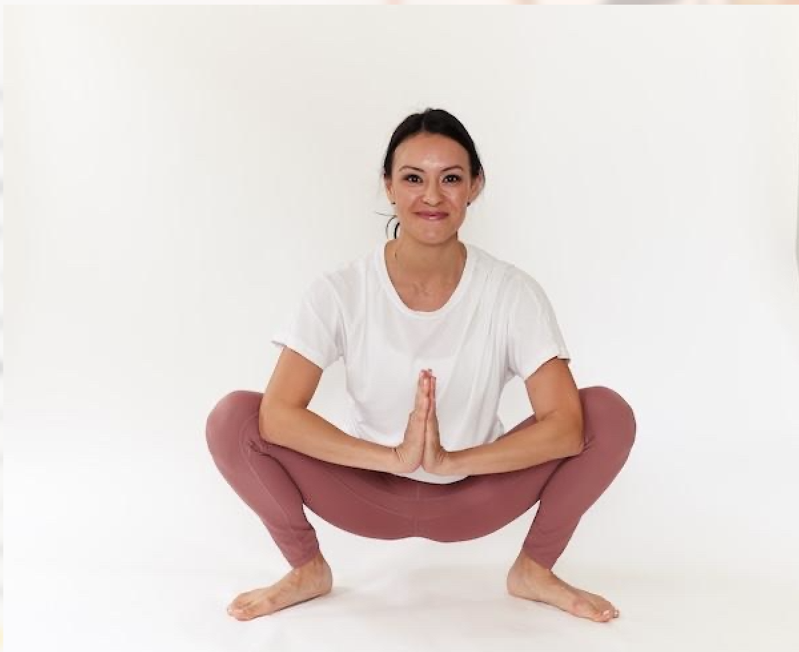
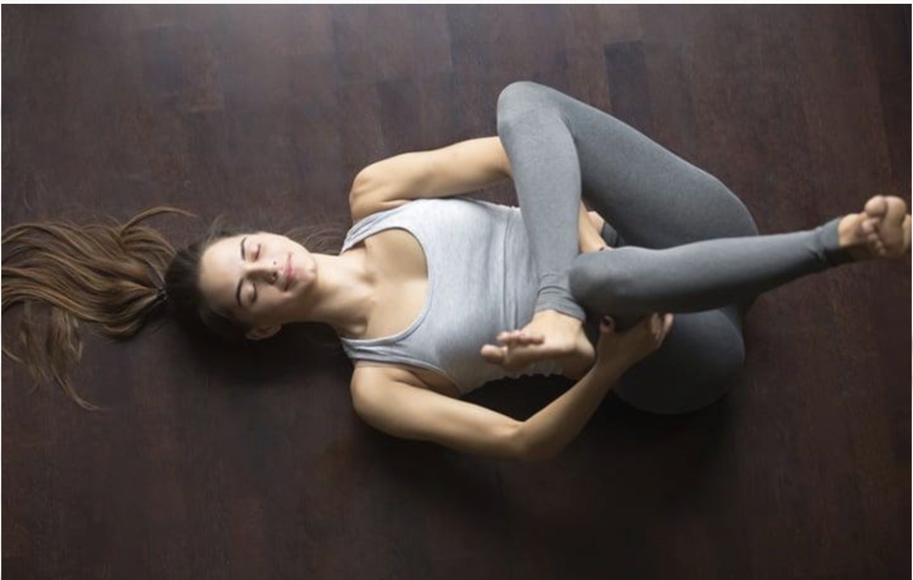
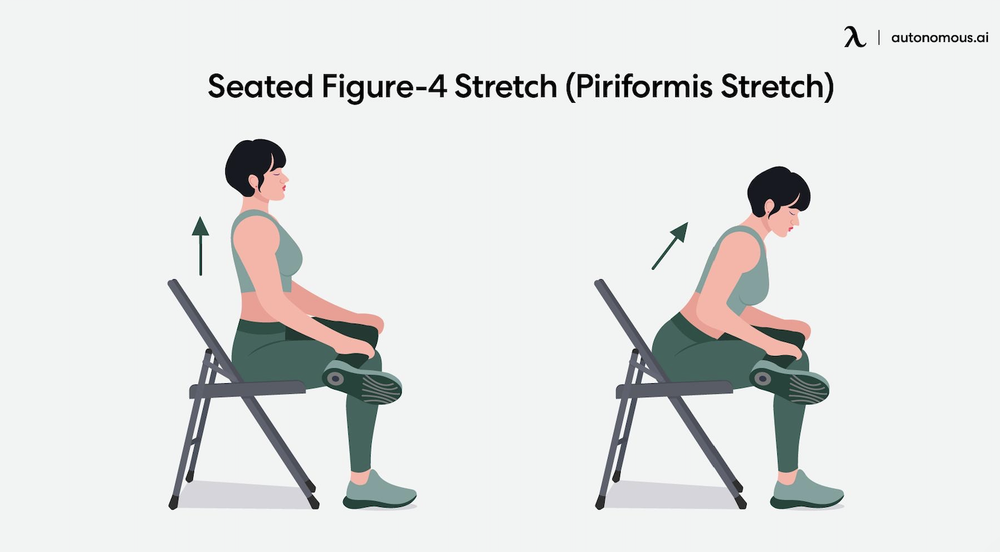
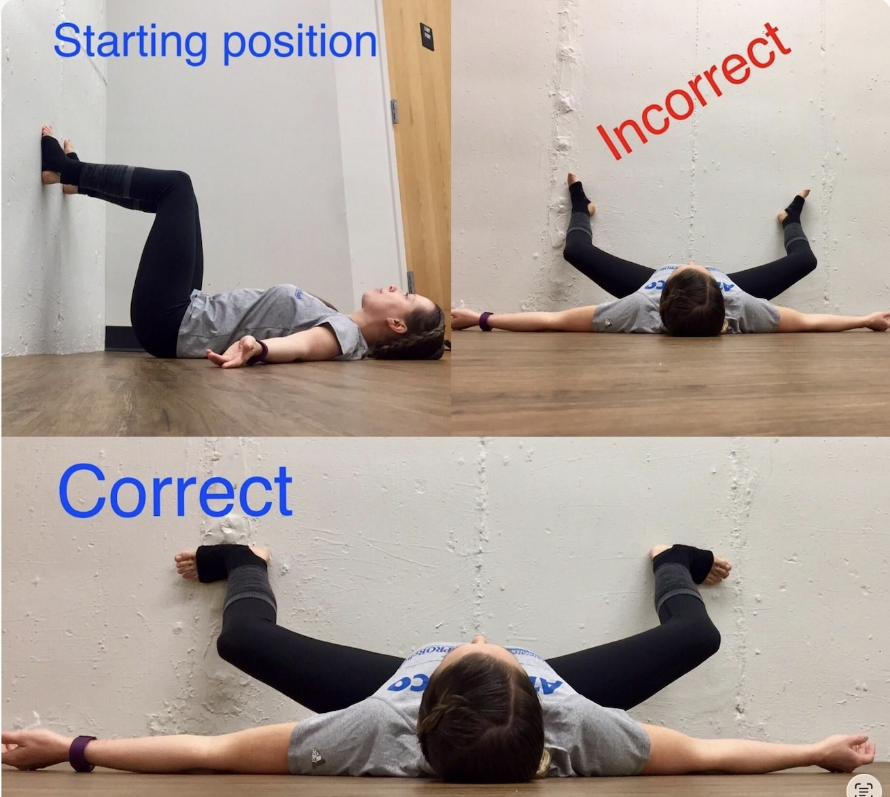
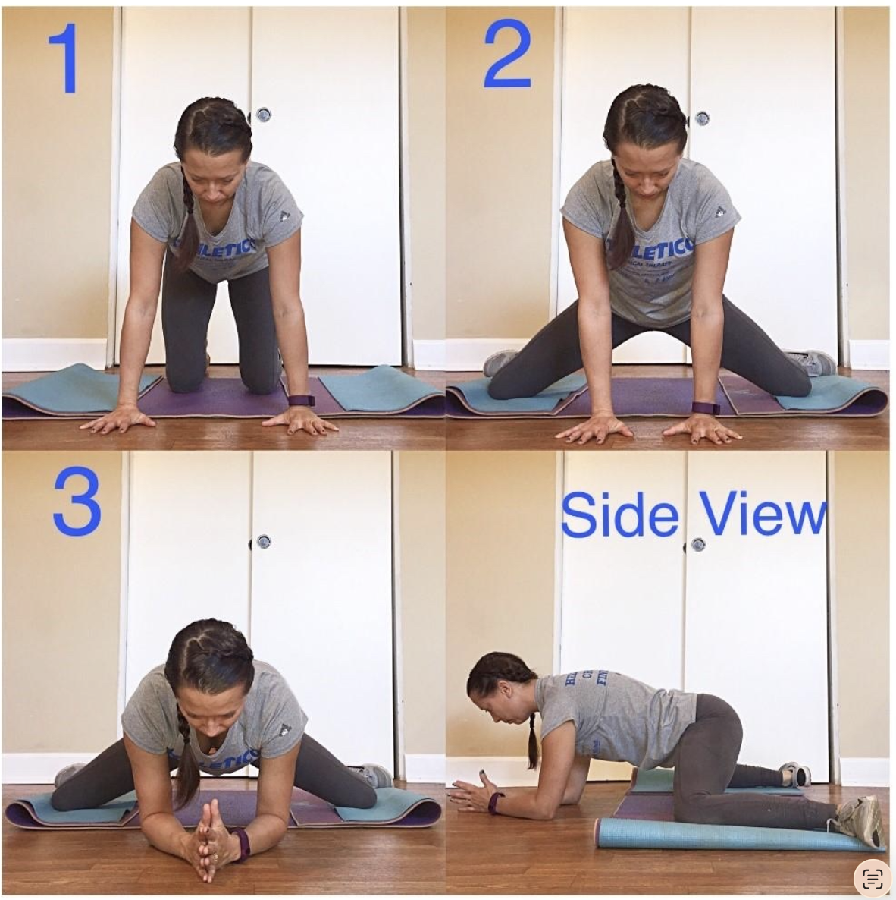
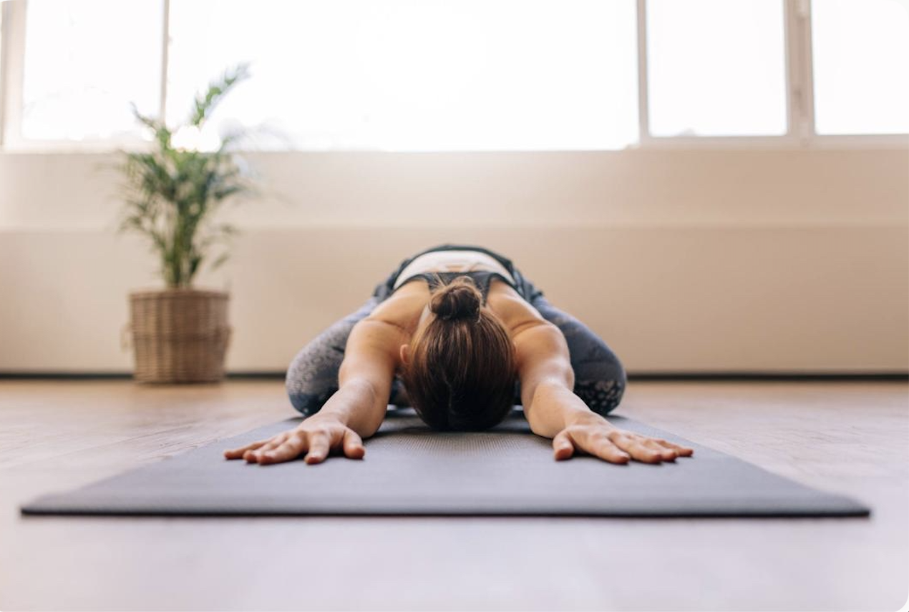
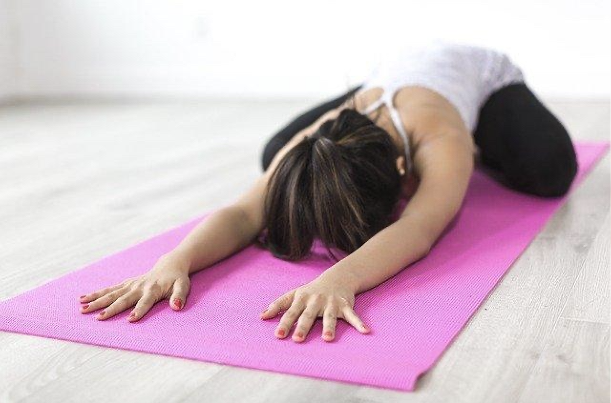
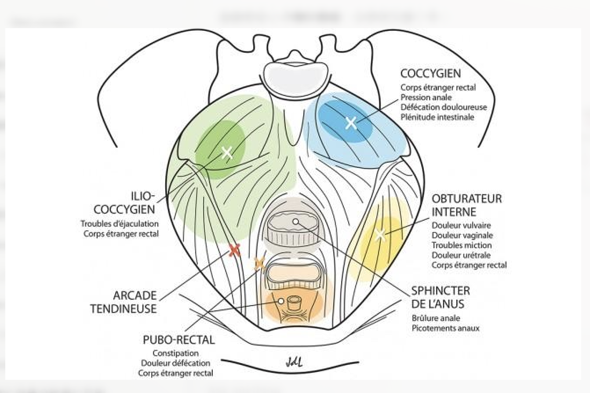
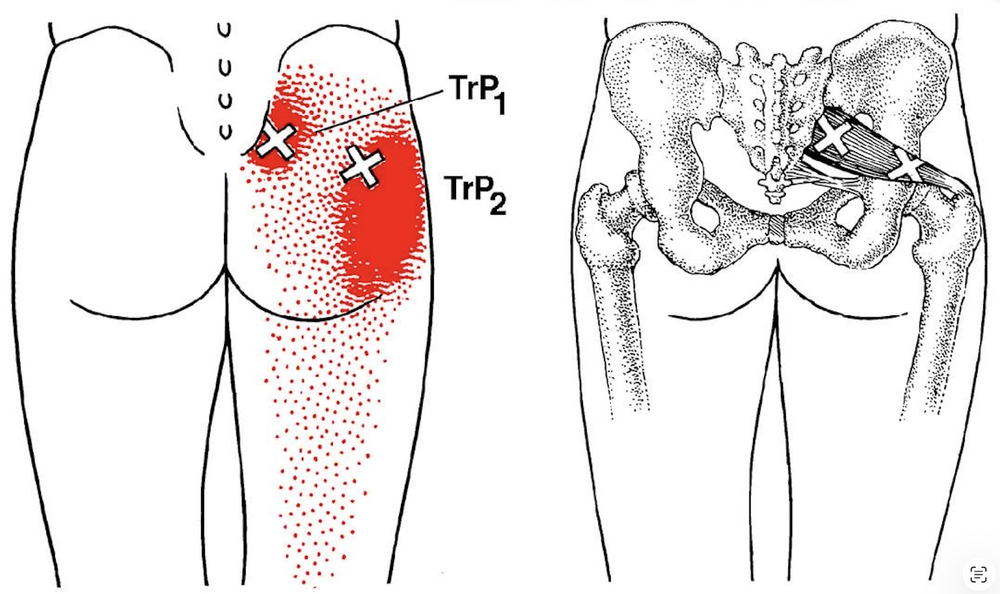

.. _sec-cppps:

最實用的兩件事（CPPS 放鬆與恢復）
==================================

.. contents::
   :local:
   :depth: 4

一、三個最有效的放鬆伸展（每天必做）
------------------------------------

1. 深蹲放鬆（最重要）
~~~~~~~~~~~~~~~~~~~~~

做法：

- 雙腳打開（比肩寬）
- 慢慢蹲下（像亞洲蹲）
- 手肘頂膝蓋，胸口打開

重點：

- 不要用力
- 感覺會陰往下放鬆

時間：

- 1–2 分鐘 × 2 次

2. 梨狀肌伸展（臀部關鍵點）
~~~~~~~~~~~~~~~~~~~~~~~~~~~

做法：

- 躺著，一腳跨在另一腳上（4字型）
- 把下方腿拉向胸口

感覺：

- 臀部深層拉伸

時間：

- 每邊 30 秒 × 2

3. 青蛙式（內收肌＋骨盆）
~~~~~~~~~~~~~~~~~~~~~~~~~

做法：

- 雙膝打開跪地
- 身體往前趴

重點：

- 放鬆骨盆底
- 配合慢呼吸

時間：

- 1–2 分鐘

二、Trigger Point 自我放鬆（關鍵突破）
--------------------------------------

重點區域：

1. 臀部深層（最重要）
2. 會陰附近
3. 大腿內側

1. 臀部 Trigger Point（優先）
~~~~~~~~~~~~~~~~~~~~~~~~~~~~~

工具：

- 網球 / 按摩球

做法：

- 坐或靠在球上（臀部）
- 找痠痛點
- 停住壓 30–60 秒

感覺：

- 痠、悶、放射感 = 正確

2. 會陰放鬆（溫和）
~~~~~~~~~~~~~~~~~~~

做法：

- 用手或熱敷
- 輕壓會陰區

重點：

- 不要用力壓
- 目標是放鬆神經

3. 內收肌放鬆（大腿內側）
~~~~~~~~~~~~~~~~~~~~~~~~~

做法：

- 用手或滾筒
- 從大腿內側慢慢壓

效果：

- 常可減少會陰與排尿不適

三、正確使用原則（非常重要）
----------------------------

- 放鬆時配合呼吸
- 不要忍痛硬壓
- 每天穩定進行
- 找點比用力更重要

四、每日建議流程（15–20 分鐘）
-------------------------------

1. 深蹲放鬆：2 分鐘
2. 梨狀肌伸展：左右各 1 分鐘
3. 青蛙式：2 分鐘
4. 臀部 Trigger Point：5 分鐘
5. 呼吸放鬆：5 分鐘

五、預期效果
--------------

- 3–7 天：刺痛或不適下降
- 2–3 週：夜間排尿改善
- 1–2 個月：整體明顯改善

六、核心觀念
--------------

這不是單點治療，而是整體調整：

- 神經放鬆
- 骨盆底放鬆
- 身體恢復自然控制
